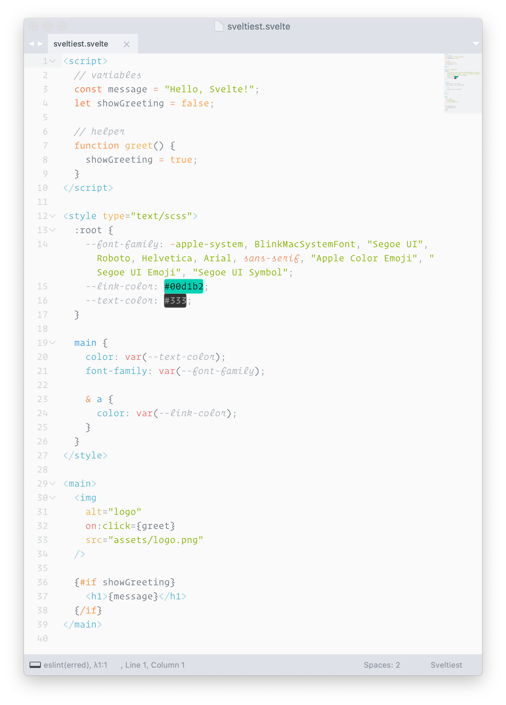

# Svelte Syntax Highlighting

Sublime Text Syntax highlighting for [Svelte 3](https://svelte.dev) components.

### Install

- Via Package Control: search for `Sveltiest`.
- Manual: clone this repo into your Sublime `Packages` folder.

**NOTE:** You still need to install corresponding packages for pre-processors (e.g. Sass, Typescript) to get proper syntax highlighting for them.

### Why Use This?

If you've disabled the built-in JavaScript module in favor of Babel's, `<script/>` sections within Svelte components will no longer be highlighted. This module enables that.

### Special Thanks

- Cornelius Ukena, for creating the original Svelte syntax highlighter module for Sublime Text 3.
- Rich Harris, for creating Svelte.

### License

[MIT](https://opensource.org/licenses/MIT)
